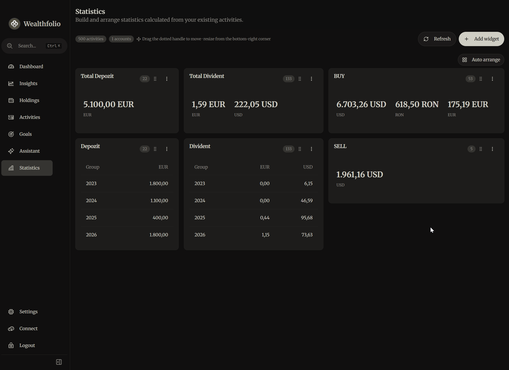

# Activity Statistics Builder for Wealthfolio

<p align="center">
  <strong>Build a personal, persistent statistics dashboard from your Wealthfolio activities.</strong>
</p>

<p align="center">
  
  
  
  
</p>

Activity Statistics Builder is a community add-on for [Wealthfolio](https://wealthfolio.app/) that turns existing portfolio activities into configurable statistics, tables, and charts. Create the metrics you care about, arrange them into a responsive dashboard, and keep the layout between sessions.

The add-on is read-only with respect to portfolio data. It never creates, edits, imports, or deletes Wealthfolio activities.

## Preview

<p align="center">
  
</p>

## Highlights

- Create value, table, line, bar, and pie widgets.
- Calculate sums, counts, averages, minimums, maximums, and cumulative values.
- Build formulas by adding or subtracting independently filtered components.
- Filter by account, activity type, instrument, currency, and status.
- Use fixed dates or dynamic periods such as current year, previous year, last 30 days, or last 12 months.
- Group results by day, ISO week, month, quarter, year, account, instrument, activity type, or currency.
- Keep currencies separate instead of silently mixing incompatible monetary values.
- Open exact activity drill-downs from calculated results.
- Refresh automatically after Wealthfolio updates the portfolio.

## Flexible dashboard layout

Every widget can be arranged independently:

- Drag the dotted handle to move a widget.
- Drag the highlighted bottom-right corner to resize it.
- Choose **Width** from the widget menu for compact, one-third, half-row, or full-row sizing.
- Select **Auto arrange** to pack existing widgets into the available horizontal space.
- Place up to four compact widgets in one desktop row.

Desktop, tablet, and mobile layouts are stored separately through the Wealthfolio add-on storage API.

## Widget builder

Each widget combines four building blocks:

| Building block | Available options |
| --- | --- |
| Visualization | Value, table, line, bar, pie |
| Calculation | Sum, count, average, minimum, maximum, cumulative, formula |
| Filters | Accounts, activity types, instruments, currencies, statuses |
| Time and grouping | Fixed/dynamic periods and chronological or categorical grouping |

The live preview validates the configuration before it is saved. Formula components may use their own filters and periods, making metrics such as deposits minus withdrawals possible without modifying the underlying data.

## Financial calculation rules

- Monetary arithmetic uses [`decimal.js`](https://mikemcl.github.io/decimal.js/) internally.
- JavaScript `number` conversion happens only when completed values are passed to formatting or chart components.
- Null and empty numeric values are ignored; invalid numeric strings produce a visible warning.
- `count` counts matching activities without requiring a numeric field.
- Currencies are never converted or combined.
- Line and bar charts create one series per currency.
- Pie widgets provide a currency selector when multiple currencies are present.
- Dates use the browser's local timezone, inclusive local-day boundaries, and ISO weeks beginning on Monday.

## Installation

### Install a release

1. Download `wealthfolio-activity-statistics-builder-addon-<version>.zip` from the latest GitHub Release.
2. Open the add-on management page in Wealthfolio.
3. Choose the option to install or sideload an add-on from a ZIP file.
4. Select the downloaded ZIP without extracting it.
5. Review and approve the declared read permissions.
6. Enable the add-on and reload Wealthfolio if needed.
7. Open **Statistics** from the sidebar.

The minimum supported Wealthfolio version is **3.6.2**.

### Build from source

Requirements:

- Node.js 24 recommended (22.13 or newer is required by pnpm 11)
- pnpm
- Wealthfolio 3.6.2 or newer for runtime testing

```powershell
git clone <your-repository-url>
cd activity-statistics-builder
pnpm install --frozen-lockfile
pnpm type-check
pnpm test
pnpm bundle
```

The installable archive is generated at:

```text
dist/wealthfolio-activity-statistics-builder-addon-<version>.zip
```

## Automated GitHub releases

The workflow in [`.github/workflows/release.yml`](.github/workflows/release.yml) publishes a release whenever a version tag such as `v1.2.0` is pushed. It:

1. Checks that the tag, `package.json`, and `manifest.json` use the same version.
2. Installs locked dependencies and runs type checking, tests, and manifest validation.
3. Builds the production add-on and its installable ZIP.
4. Generates a matching `.sha256` checksum file.
5. Creates the GitHub Release, generates release notes, and uploads both files.

To publish a new version, update the version in both JSON files, commit and push the change, then create and push the matching tag:

```powershell
git tag -a v1.2.0 -m "Activity Statistics Builder v1.2.0"
git push origin v1.2.0
```

The workflow uses the repository's built-in `GITHUB_TOKEN`; no personal access token or additional GitHub secret is required.

If an automatic run fails because the workflow itself needs a correction, push the correction first, then open **Actions → Release add-on → Run workflow** and enter the existing tag. The manual run checks out and builds that exact tag, so the tag does not need to be deleted or moved.

## Permissions and privacy

| Access | Why it is needed |
| --- | --- |
| `accounts.getAll` | Populate account filters and labels |
| `activities.getAll` | Calculate statistics from existing activities |
| `events.portfolio.onUpdateComplete` | Refresh statistics after a portfolio update |
| Add-on storage | Persist widget configuration and responsive layouts |

The add-on requests no network access and uses no external APIs, secrets, browser `localStorage`, or direct database access.

Stored keys:

```text
dashboard.schema-version
dashboard.widget-index
dashboard.layout.desktop
dashboard.layout.tablet
dashboard.layout.mobile
widget.<uuid>
```

Only configuration and layout data are stored. Calculated results are always rebuilt from current Wealthfolio activities.

## Development commands

```powershell
pnpm dev                 # Rebuild when source files change
pnpm type-check          # Strict TypeScript validation
pnpm test                # Run the test suite
pnpm validate:manifest   # Validate manifest.json
pnpm build               # Create production chunks
pnpm bundle              # Clean, build, and create the installable ZIP
```

The calculation engine and storage behavior are covered by automated tests, including multi-currency aggregation, formulas, filters, periods, drill-down references, responsive layout placement, and compatibility fallbacks.

## Project structure

```text
src/
├── components/    Dashboard, widget builder, visualizations, drill-down
├── engine/        Filtering, grouping, aggregation, formulas
├── hooks/         Wealthfolio data, storage, and event integration
├── storage/       Persistent dashboard repository and migrations
├── types/         Dashboard and statistics models
├── utils/         Decimal, date, formatting, layout, and compatibility helpers
└── validation/    Widget schema and compatibility rules
```

## Troubleshooting

### Add-on times out during `sandbox document loaded`

This phase happens before Wealthfolio sends the add-on code to the sandbox. On slower self-hosted deployments, make sure browser caching is enabled and JavaScript/CSS assets are served with gzip or Brotli compression. Close DevTools when testing because **Disable cache** can force the large Wealthfolio host bundles to download again.

### Statistics does not appear immediately after startup

The add-on starts eagerly so it can reuse warm Wealthfolio assets. Wait a moment after reloading the application. If startup failed, reload Wealthfolio after checking the browser console and server connectivity.

## Contributing

Issues and pull requests are welcome. Before submitting a change, run:

```powershell
pnpm type-check
pnpm test
pnpm validate:manifest
pnpm build
```

Please keep financial calculations decimal-safe, currencies separated, portfolio access read-only, and new behavior covered by tests.

## License

Released under the [MIT License](LICENSE).

---

<sub>This is a community project and is not an official Wealthfolio product.</sub>
